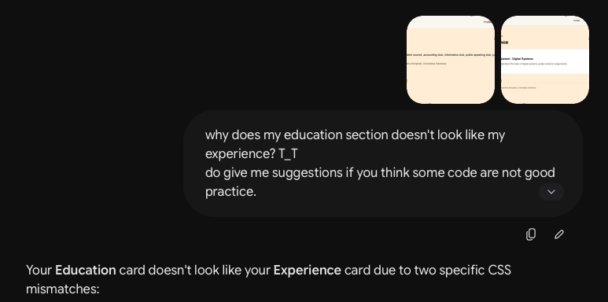
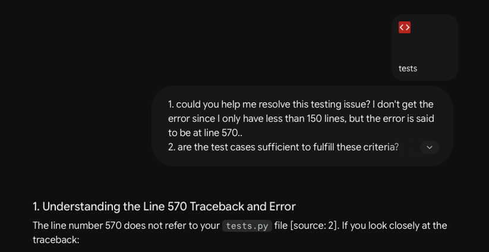

Name: **Paramita Santoso**

NPM: **2506554171**

Class: **KKI**<br>

### Description
This project is a portofolio website which displays my academic profile, experiencesm, interests, and many more.<br><br>

### Tech Stack
- **Backend**: Python (Django)
- **Frontend**: HTML5, CSS3
<br><br>

### Set up locally
1. Clone the repository:
    ```
    git clone https://github.com/paramitasan/myportofolio.git
    cd myportofolio
    ```

2. Create and activate a virtual environment:
    - MacOS/Linux
    ```
    python3 -m venv env
    source env/bin/activate
    ```
    - Windows
    ```
    python -m venv env
    env\Scripts\activate
    ```
3. Install the dependencies:
    ```
    pip install -r requirements.txt
    ```

4. Apply database migrations:
    ```
    python manage.py migrate
    ```

5. Run the server:
    ```
    python manage.py runserver
    ```
6. Open `http://127.0.0.1:8000/` in your browser
<br>

---
### Week 5 - 05 Oct 2026
- Implemented toast notification (success messages, informative error messages)
- Created modal form for adding new Experience and Education record
- Implemented adding data with AJAX
- Displayed Education and Experience data with AJAX
- Applied search debouncing for Education and Experience search
- Displayed number of data found ★
- Protected the webpage from XSS attacks (`strip_tags`, `clean_field`)<br>

###### Reflection
1. 
    Debouncing is a performance optimization technique that delays the execution of a function until a specific amount of time has passed since the last event was triggered. In an AJAX search feature, debouncing waits for the user to pause typing (e.g., for 300 milliseconds) before sending a request to the server.
    Without debouncing, every single keystroke makes different AJAX request. For instance, 'Django' would trigger 6 requests. Many search requests at a time strains the database, which could cause a server overload.
2. 
    `fetch()` is asynchronous—meaning network requests take time to travel to the server and back, so JavaScript runs `fetch()` in the background without blocking the rest of the browser. Because of this, `fetch()` returns a `Promise` (a placeholder object representing a future result) rather than the actual data right away.
    To wait for `fetch()` to retrieve the actual data, we use `await`—telling JavaScript to pause execution inside an async function until `Promise` is resolved.
    If we did not use `await`, JavaScript will immediately execute the following line of codes before the server gives the actual data. Instead of data, we will be left with unresolved `Promise` object.
3. 
    Cross-Site Scripting (XSS) is an attack in which an attacker injects malicious client-side code (usually JavaScript) into a web application. When other users visit the page, their browser executes the attacker's script, which can steal session cookies, access sensitive storage, or perform unauthorized actions on behalf of the user.
    When using JavaScript to insert JSON data into the page (e.g., using `element.innerHTML = templateLiteral`), the browser does not automatically escape characters. If raw data containing  `` is injected directly into innerHTML, the browser parses it as active HTML and executes the embedded script immediately.
    On the other hand, Django's template engine automatically escapes HTML characters in rendered variables. If an attacker submits `<script>stealCookies()</script>`, Django converts it to plain text on render, displaying the characters safely without running the script.
    This is why AJAX/JavaScript is more vulnerable to XSS attack compared to Django. <br>

###### AI Disclosure
I used Google Gemini to help me check my code, fix flawed logic, give suggestions, and debug errors when the rendered page doesn't appear according to my expectations.

- Prompts:
    - "The education data doesn't show.. what's wrong? Is there any syntax error or typo ..."
    - "Is this correct if I want to make AJAX way of fetching my experience data? Pay special attention for the data type declared to be shown in the page. If there's any incorrect format, please point it out and explain why it may cause error"
    - "Both my education and experience page are working okay, but there's something wrong for experience: I need to click the Search button before being able to see the data. If I don't click the Search button, the data won't load. Do you know what's wrong, why it's wrong, and how to fix it?"
    - "If I want to add result count, is this how I'm supposed to do it? (Search for result-count) 
    How to ensure the result count only shows if there's experience result (not error, loading, or empty)?"

- AI's Limitation & Manual Fix:
    - Sometimes, the AI offers redundant/unmatching code solutions. As a result, I had to crosscheck between my code and suggested code so that there are no duplicates or mismatched variables.

---
### Week 4 - 28 Sep 2026
- Implemented authentication (register, log in, log out)
- Implemented session and cookies (display and deletion of `last_login`)
- Replaced usage of secret code with user status checking (`is_editor`, `is_superuser`)
- Added star feature for Education and Experience page
- Implemented authorization across pages
    - Visitors can only view
    - Registered users can view + star/unstar
    - Editor can view + star/unstar + edit content
    - Superuser can view + star/unstar + create content + edit content + delete content<br>

###### AI Disclosure
I used Google Gemini to help confirm and/or revise my logic for code drafts. I also used Google Gemini as a guide for using git so that my commit history can be tidy.

- Prompts:
    - "I've written this as context in all the edit func in views.py, but now the edit button wouldn't show even though I'm logged in as superuser. what went wrong?"
    - "currently there are 3 kinds of user: visitor, registered user, and superuser. visitor can only see, registered user can do star, superuser can do all, from star to create, edit, and delete. now, I want to add editor class which can see, star, and edit. so for edit funct, I just need to update it into this right `if not request.user.is_superuser and not request.user.is_editor: raise PermissionDenied`? however, what should I do to create a new group called editor and assign specific users for the role? please provide me the code, where I should write it (views.py, x.html), and give explanation + source if possible"
    - "I want to push 3 commits into 2 different brances (1 branch has existed - feat/authentication-session-cookie, the other one I want to make is feat/experience_star). how to make it possible? do I cherry pick 7466a81 f6655e4 then push to feat/authentication-session-cookie, then cherry pick 72fce7d then push to feat/authentication-session-cookie? please give me a clear guidance so there will be no issue with my git"
    - "how to check if my website's JSON endpoint keeps working without leaking sensitive information?"
- AI's Limitation & Manual Fix:
    - AI suggested me to fix my code with return type that does not fit my website structure, i.e {True} instead of True. I had to change some of the suggested code so that it would be compatible with the project I have written. <br>

---
### Week 3 - 21 Sep 2026
- Implemented skeleton (base.html) as the main layout framework
- Implemented forms (forms.py)
- Implemented data delivery with JSON
- Added create, edit, and delete feature in Education and Experience page
- Added a secret code to ensure that only I can edit the page<br>

###### Reflection
1. 
    a. Instead of creating HTML forms from scratch, we use Django's ModelForm because it provides the 'skeleton' of the form. It automatically generates HTML form fields from our database models, validates data using database constraint (e.g. Education `start_year` has to be 4 digits and has to be bigger than 2010), cleans user inputs safely, and generates error messages when invalid data is submitted.

    b.  `` are required to be added into these forms because it generates a random, secret token for each soon-to-be created form. When submitted, Django compares this token against the user's session. If they don't match, the request is rejected. This prevents Cross-Site Request Forgery (CSRF) attacks.
2. JSON is more preferred in modern web application development compared to XML because JSON uses compact key-value pairs (`"title: MyTitle"`) without repetitive opening/closing tags (`<title> MyTitle </title>`), which is easier to read and lighter in size. Additionally, JavaScript can natively parse JSON without complex XML DOM parsers.
3. The flow that occurs when view function is used to return portfolio data in JSON format:
    - Request: client sends an HTTP GET request to a specific URL (e.g., `/api/experience/`).
    - Routing: urls.py routes the request to the designated view function (e.g., `get_experience_json`).
    - Query: The view retrieves data from the database (e.g., `Experience.objects.all()`), which returns a collection of Python model instances.
    - Serialization: The view passes these instances to `serializers.serialize("json", ...)` to convert the Python objects into JSON string.
    - Response: The serialized JSON string is returned as an `HttpResponse` (with `content_type="application/json"`) and sent back to the client.

We need to perform the serialization process on Django models before returning the data because serialization flattens complex database objects into a standardized, plain-text string structure (JSON) that can be sent over the internet and natively parsed by web browsers or frontend applications.<br>

###### AI Disclosure
I used Google Gemini to confirm the logic used in my code and help me debug error codes.

- Prompts:
    - "I would like to make the writing in the form to be different depends on whether it's editing or creating. if create it will show 'Add Education Record', if edit it will show 'Edit Education Record'. I want to change the text in some other place as well. does it use if else logic?"
    - "Why after I click delete record and enter password, data is still in page and not deleted?"
    - "Are the field type I put in ExperienceForm already compatible with the input received by model Experience? If no, please provide the correction and/or suggestions"
    - "When I open Experience page, this error shows. Please help me debug this and debug potential bugs. Do seperate them and explain to me why it can cause issues
    `Reverse for 'edit_experience' with arguments '('',)' not found. 1 pattern(s) tried: ['experience/(?P<exp_id>[0-9a-f]{8}-[0-9a-f]{4}-[0-9a-f]{4}-[0-9a-f]{4}-[0-9a-f]{12})/edit/\\Z']`"
- AI's Limitation & Manual Fix:
    - AI sometimes can't grasp the whole context of my code. When I asked to help solve my error, its suggestions leads to another error. Therefore, while I used AI's suggestion, I also debug it myself (using Django's traceback messages to identify missing variables or broken URL routing).<br>

---
### Week 2 - 14 Sep 2026
- MTV (Model, Template, View) Django implementation
- Django unit test
- Added education and experience section<br>

###### Reflection
1. When opening the new portofolio page (Education page), user clicks or enters the link http://127.0.0.1:8000/education/. The link will be accepted by project's urls.py (portofolio/urls.py) and directed to the app's urls.py (main/urls.py). In main/urls.py, the matching path (education/) is located, and the assigned view in main/views.py ("show_education") is executed. Inside the function, views.py obtains the needed data (i.e. Education.objects) through main/models.py (models.py fetches the data from the database). When the required data is complete, views.py passes it to the designated HTML template (education.html), which is the skeleton of the website. With tags like  and {{ edu.institution_name }}, Django compiles a dynamic HTML page. Finally, the view sends the compiled HTML page back to the browser, which renders it on screen.
2. Instead of writing the data for the new portfolio section directly in the template, storing the data in a model keeps data separate from page layout (HTML presentation). Design changes in templates won't affect stored data, and updating data won't risk breaking HTML structure. Additionally, it makes the code scalable. Whenever we have to add new data, we just need to add new object to the model, no need to edit the website layout.
3. makemigrations records the changes made to the model in models.py and creates migration blueprints in main/migrations. migrate reads the blueprint and make the changes to the database. For example, when I first made Education model without attribute description, models.py was updated, but my database isn't updated yet. Running `python manage.py makemigrations` generated the blueprint file for this update, and running `python manage.py migrate` actually made changes to the database table so it could store and retrieve descriptions without throwing an error. <br>

###### AI Disclosure
I used Google Gemini (hereafter referred as Gemini) to help me debug coding errors which caused my web not match my expectations. I also asked Gemini suggest improvements regarding my code, which helped reduce code duplication in my style.css file.
<br>


Lastly, I also asked Gemini to help solve an issue I could not address when creating unit tests.
<br>

---
### Week 1 - 07 Sep 2026
- Initial setup
- Added hero
- Added skills section ★<br>

###### Reflection
1. I used 'section', one of HTML5's semantic elements, to help me clearly seperate between distinct parts within my portofolio website (i.e. "hero" and "skills"). Section "hero" consists of my introduction, so detailed information is put in a different section. In my case, I put some of my skills and their illustrations on section "skills".
Additionally, each section has a unique id which can be used as a hyperlink — to jump from the landing page to desired section.
2. When I set up my CSS to stay responsive, I had to make sure that my multicolumn item not get squished in small-screen view and ensure the images I put in section "skills" move dynamically according to the page size.
I decided that the elements needed to be prioritized are the images, because they are large in size and they are the most affected when page size are changed. 
I used CSS Grid so my skill images automatically drop down into a single line when the screen gets narrow.
3. Since the web is currently static, visitors can't really interact with the images and texts in my web. They can only see them. Hence, for future advancement, I would like to add clickable skill cards which can display more than just text (e.g. certificates).<br>

###### AI Disclosure
I used Google Gemini to assist me in checking and fixing my code skeleton layout, also to help me debug errors that occur in my code.
